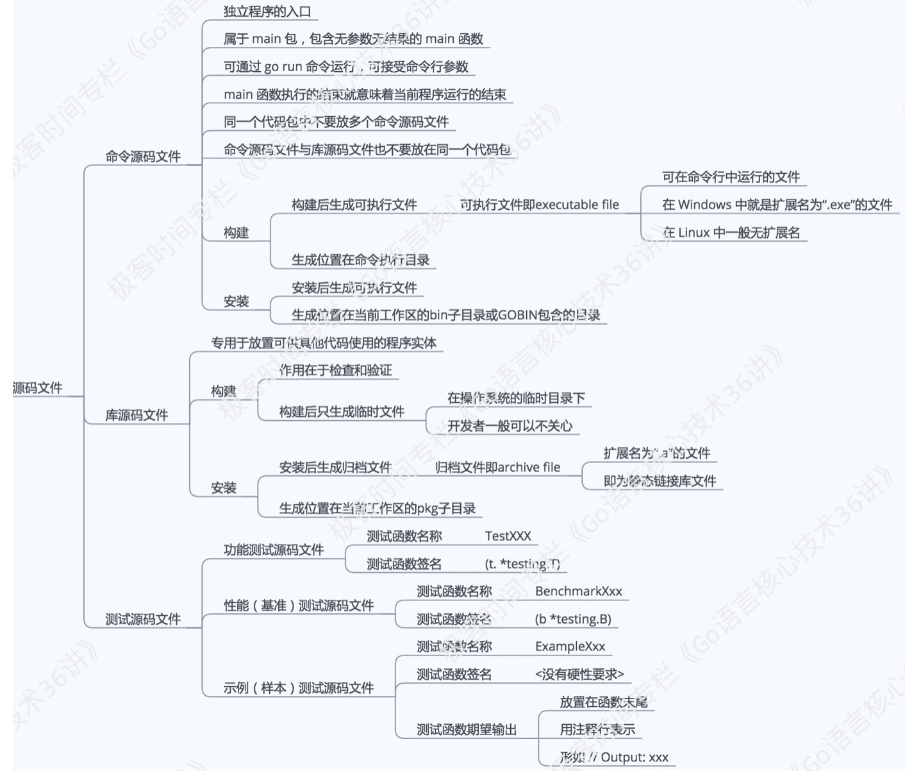

1. 你知道设置GOPATH有什么意义吗？
    >可以将GOPATH简单理解成Go语言的工作目录，她的值是一个目录的路径，也可以是多个目录路径，每个目录代表Go语言的一个工作区(workspace)。我们需要利于这些工作区，去放置Go语言的源文件以及安装后的归档文件和可执行文件 
2. Go语言源码的组织方式         
    >Go语言的源码也是以代码包为基本组织单位的。在文件系统中，这些代码包其实是与目录一一对应的。由于目录可以有子目录，所以代码包也可以有子包。一个代码包中可以包含任意个以.go为扩展名的源码文件。这些源码文件都被声明属于同一个代码包。代码包的名称一般会与源文件所在的目录同名。如果不同名，那么在构建，安装的过程中会以代码包名为准。在工作区，一个代码包的导入路径实际上就是从src子目录，到该包的实际存储位置的相对路径。所以说Go语言的源码的组织方式就是以环境变量GOPATH，工作区，src目录和代码包为主线的，一般情况下，Go语言的源码文件需要被存放在环境变量GOPATH包含的某个工作区(目 录)中的src目录下的某个代码包(目录)中。
3. 了解源码安装后的结果             
    >源码文件通常会被放在某个工作区的src子目录下。安装后如果产生了归档文件(以".a"为扩展名的文件)就会被放进工作区的pkg子目录；如果产生了可执行的文件，就可能放进该工作区的bin子目录。   

    >归档文件会以代码包的形式组织起来，一个代码包对应一个目录，安装某个代码包而产生的归档文件是与这个代码包同名的，放置它的相对目录就是该代码包的导入路径的直接父级。总之，某个工作区的src子目录下的源码文件在安装后一般会被放置在当前工作区的pkg子目录下对应的目录中，或者被直接放置该工作区的bin子目录中
4. 理解构建和安装go程序的过程    
    >构建使用的是go build命令，安装使用go install 命令。构建和安装代码包都会执行编译，打包操作。并且这些操作产生的任何文件都会被保存到某个临时的目录中。

    >如果构建的是库源码文件，那么操作后产生的结果文件只会存在于临时目录中。这里构建的主要意义在于检查和验证

    >如果构建的是命令源码文件，那么操作的结果文件会被搬运到源码文件所在的目录中

    >安装操作会先执行构建，然后在执行链接操作，并且把结果搬运到指定目录。进一步说，如果安装的是库源码文件，那么结果文件会被搬运到它所在工作区的pkg目录下的某 个子目录中。如果安装的是命令源码文件，那么结果文件会被搬运到它所在工作区的bin目录中，或者环境变 量GOBIN指向的目录中。
5. 源码文件    
    >Go语言的源码文件有三大类，即：命令源码文件、库源码文件和测试源码文件。他们的功用各不相同，而写法也各有各的特点。命令源码文件总是作为可执行的程序的入口。库源码文件一般用于集中放置各种待被使用的程序实体（全局常量、全局变量、接口、结构体、函数等等）。而测试源码文件主要用于对前两种源码文件中的程序实体的功能和性能进行测试。另外，后者也可以用于展现前两者中程序的使用方法。
6. 如何确定那些代码包被编译了？
    >在运行go build命令的时候，默认是不会编译目标代码包所依赖的那些代码包。当然，如果被依赖的代码包的归档文件不存在，或者源码文件有了变化，那他还是会被编译，如果要强制编译它们，可以在执行命令的时候加入标记-a。

    >1. 运行go build命令时加入标记-x，这样可以看到go build命令具体都执行了哪些操作。另外也可以加入标记-n，这样可以只查看具体操作而不执行它们。
    >2. 运行go build命令时加入标记-v，这样可以看到go build命令编译的代码包的名称。 它在与-a标记搭配使用时很有用。
7. go get命令     
    >go get命令会自动从一些主流公用代码仓库下载目标代码包，并把他们安装到环境变量GOPATH包含的第一工作区的相应目录中。如果存在环境变量GOBIN，那么仅包含命令源码文件包会被安装到GOBIN指向的目录。    
    常用的几个标记有下面几种：   
    <ul>
        <li>-u:下载并安装代码包，不论工作区是否已经存在他们
        <li>-d:只下载代码包，不安装代码包
        <li>-fix:在下载代码包后运行一个用于根据当前GO语言版本修正代码工具然后再安装代码包
        <li>-t:同时下载测试所需的代码包
        <li>-insecure:允许通过非安全的网络协议下载和安装代码包。HTTP就是这样的协议。
    </ul>
8. 源码文件


    >命令源码文件的用途，如何编写？   
    命令源码文件是程序的入口，是每个可独立运行的程序必需拥有的。我们可以通过构建或安装，生成与其对应的可执行文件，后者一般会与该命令源码文件的直接父目录同名。
    
    >命令源码文件：如果一个源码文件声明属于main包，并且包含一个无参数声明且无结果声明的main函数，那么它就是命令源码文件。如下：
    ```golang
    package main
    import "fmt"
    func main() {
    fmt.Println("Hello, world!")
    }
    对于一个独立的程序来说，命令源码文件永远只能有一个。如果有与命令源码文件同名的源码文件，那么他也应该声明属于main包
    ```
9. 命令源码文件怎么接受参数     
    ```golang
    package main

    import (
        "flag"
        "fmt"
    )

    var name string

    func init() {
        flag.StringVar(&name, "name", "everyone", "The greeting object.")

    }

    func main() {
        flag.Parse()//用于真正解析命令参数，并把他们的值赋给相应的变量
        fmt.Printf("Hello, %s!\n", name)
    }
    ```
    >flag包专门用于接受和解析命令参数。   
    flag.StringVar(&name, "name", "everyone", "The greeting object.")方法
    <ul>
        <li>第1个参数是用于存储该命令参数值的地址，具体到这里就是在前面声明的变量name的地址了， 由表达式&name表示。
        <li>第2个参数是为了指定该命令参数的名称，这里是name。
        <li>第3个参数是为了指定在未追加该命令参数时的默认值，这里是everyone。
        <li>至于第4个函数参数，即是该命令参数的简短说明了，这在打印命令说明时会用到。
    </ul>

    >顺便说一下，还有一个与flag.StringVar函数类似的函数，叫flag.String。这两个函数 的区别是，后者会直接返回一个已经分配好的用于存储命令参数值的地址。如果使用它的话，我们就需要把```var name string```改为```var name = flag.String("name", "everyone", "The greeting object.")```
10. 代码包声明的基本规则
    >1.源码文件声明的包名可以与其所在的目录名称不一致。在针对代码包进行构建时，生成的结果文件的主名称与其父目录的名称一致。   
        2. 同目录下的源码文件的代码包声明语句要一致，也就是说他们属于同一个代码包。如果目录中有命令源码文件，那么其他种类的源码文件也应该属于main包   
11. Go语言的类型推断可以带来哪些好处?
    >比如代码重构：```var name = getTheFlag()```,你可以看到我们可以随意的改变getTheFlag函数的内部实现，及其返回结果类型，而不用修改main函数中的任何代码。我们不显式的指定变量name的类型，使得他可以被赋予任何类型的值，也就是说，变量name的类型可以在其初始化时由其他程序动态的指定。在你改变getTheFlag函数的结果类型之后，Go语言的编译器会在你再次构建该程序的时候，自动地更新变量name的类型。Go语言是静态类型的，所以一旦在初始化变量时确定了它的类型，之后就不可能再改变。这就 避免了在后面维护程序时的一些问题。另外，请记住，这种类型的确定是在编译期完成的，因此 不会对程序的运行效率产生任何影响。

    >总之来说，Go语言的类型判断可以明显提升程序的灵活性，使的代码重构变得更加容易，同时又不会给代码的维护带来额外的负担，更不会损失程序的运行效率。
12. 变量的重声明是什么意思?
    >其含义是对已经声明过的变量再次声明。变量重声明的前提条件如下：   
    1. 由于变量的类型在其初始化的时候就已经确定了，所以对他再次声明时赋值的类型必须和原本的类型相同，否则会产生编译错误。
    2. 变量的重声明只可能发生在某一个代码块中。如果与当前的变量重名的是外层代码块中的变量，那么就是另一种含义了。
    3. 变量的重命名只有在使用短变量声明时才会发生，否则无法通过编译。如果要在此声明全新的变量，那么就应该使用包含关键字var的声明语句。但是这时就不能与同一个代码块 中的任何变量有重名了。
    4. 被“声明并赋值”的变量必须是多个，并且其中至少有一个是新的变量。这时我们才可以说对 其中的旧变量进行了重声明。
    >这样来看，变量重声明其实算是一个语法糖(或者叫便利措施)。它允许我们在使用短变量声明 时不用理会被赋值的多个变量中是否包含旧变量
13. 如果一个变量与其外层代码块中的变量重名会出现什么状况？    
    ```golang
    package main

    import "fmt"

    var block = "package"

    func main() {
        block := "function"
        {
            block := "inner"
            fmt.Printf("The block is %s.\n", block)
        }
        fmt.Printf("The block is %s.\n", block)
    }

    程序输出：
    The block is inner.
    The block is function.
    ```
    >解析：   
    对于不的代码块，变量重名没什么，代码可以通过编译。   
    1）引用变量的时候总会优先查找当前那个变量。“当前代码块”仅仅是引用变量的代码所在的那个代码块，并不包含任何子代码块。   
    2）如果当前代码块中没有声明以此为名的变量，程序会沿着代码块的嵌套关系，从直接包含当前代码块的那个代码块开始，一层一层的查找。   
    查找过程：从小作用域到大作用域。    
    典型回答：如果变量重名，在全域代码块中声明的变量会被子代码中的重声明覆盖，在子代码块声明的变量，只能在该代码块中生效和使用。
