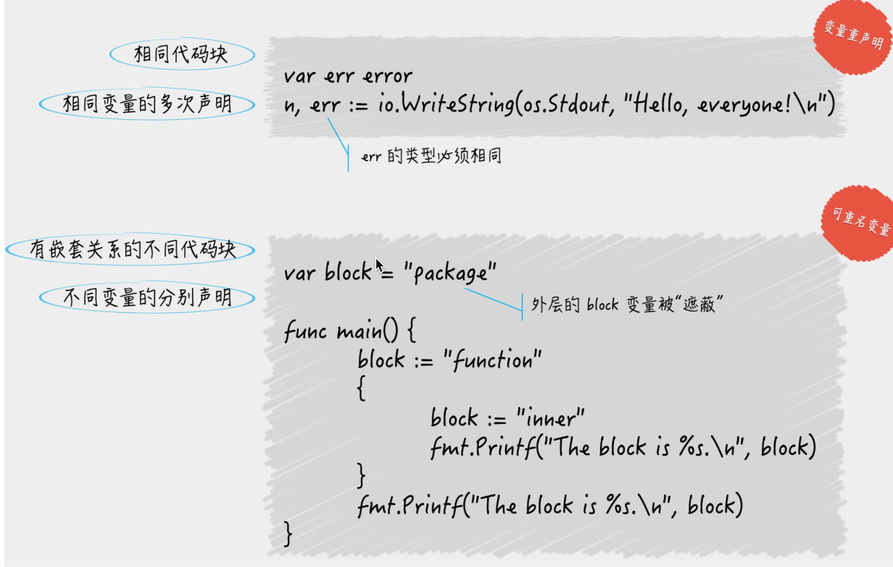
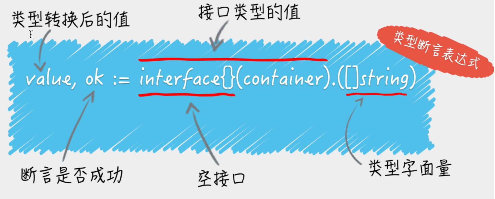
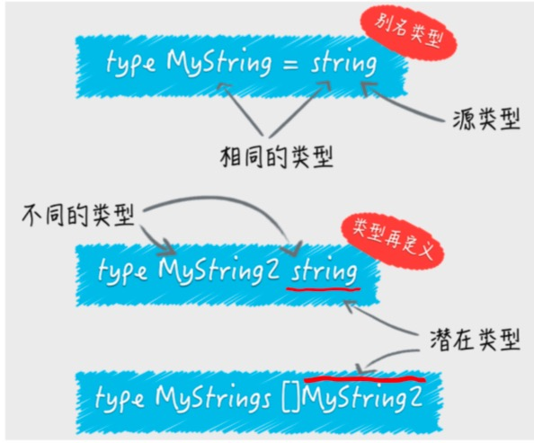
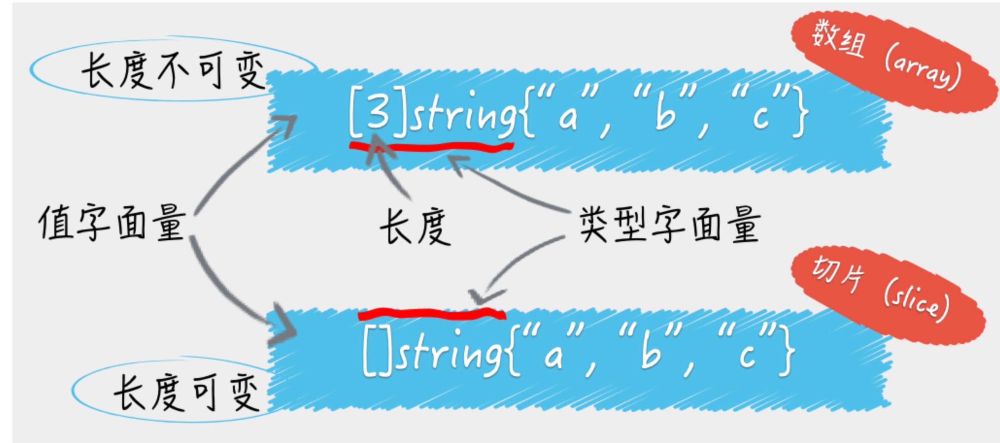

1. 你知道设置GOPATH有什么意义吗？
    >可以将GOPATH简单理解成Go语言的工作目录，她的值是一个目录的路径，也可以是多个目录路径，每个目录代表Go语言的一个工作区(workspace)。我们需要利于这些工作区，去放置Go语言的源文件以及安装后的归档文件和可执行文件 
2. Go语言源码的组织方式         
    >Go语言的源码也是以代码包为基本组织单位的。在文件系统中，这些代码包其实是与目录一一对应的。由于目录可以有子目录，所以代码包也可以有子包。一个代码包中可以包含任意个以.go为扩展名的源码文件。这些源码文件都被声明属于同一个代码包。代码包的名称一般会与源文件所在的目录同名。如果不同名，那么在构建，安装的过程中会以代码包名为准。在工作区，一个代码包的导入路径实际上就是从src子目录，到该包的实际存储位置的相对路径。所以说Go语言的源码的组织方式就是以环境变量GOPATH，工作区，src目录和代码包为主线的，一般情况下，Go语言的源码文件需要被存放在环境变量GOPATH包含的某个工作区(目 录)中的src目录下的某个代码包(目录)中。
3. 了解源码安装后的结果             
    >源码文件通常会被放在某个工作区的src子目录下。安装后如果产生了归档文件(以".a"为扩展名的文件)就会被放进工作区的pkg子目录；如果产生了可执行的文件，就可能放进该工作区的bin子目录。   

    >归档文件会以代码包的形式组织起来，一个代码包对应一个目录，安装某个代码包而产生的归档文件是与这个代码包同名的，放置它的相对目录就是该代码包的导入路径的直接父级。总之，某个工作区的src子目录下的源码文件在安装后一般会被放置在当前工作区的pkg子目录下对应的目录中，或者被直接放置该工作区的bin子目录中
4. 理解构建和安装go程序的过程    
    >构建使用的是go build命令，安装使用go install 命令。构建和安装代码包都会执行编译，打包操作。并且这些操作产生的任何文件都会被保存到某个临时的目录中。

    >如果构建的是库源码文件，那么操作后产生的结果文件只会存在于临时目录中。这里构建的主要意义在于检查和验证

    >如果构建的是命令源码文件，那么操作的结果文件会被搬运到源码文件所在的目录中

    >安装操作会先执行构建，然后在执行链接操作，并且把结果搬运到指定目录。进一步说，如果安装的是库源码文件，那么结果文件会被搬运到它所在工作区的pkg目录下的某 个子目录中。如果安装的是命令源码文件，那么结果文件会被搬运到它所在工作区的bin目录中，或者环境变 量GOBIN指向的目录中。
5. 源码文件    
    >Go语言的源码文件有三大类，即：命令源码文件、库源码文件和测试源码文件。他们的功用各不相同，而写法也各有各的特点。命令源码文件总是作为可执行的程序的入口。库源码文件一般用于集中放置各种待被使用的程序实体（全局常量、全局变量、接口、结构体、函数等等）。而测试源码文件主要用于对前两种源码文件中的程序实体的功能和性能进行测试。另外，后者也可以用于展现前两者中程序的使用方法。
6. 如何确定那些代码包被编译了？
    >在运行go build命令的时候，默认是不会编译目标代码包所依赖的那些代码包。当然，如果被依赖的代码包的归档文件不存在，或者源码文件有了变化，那他还是会被编译，如果要强制编译它们，可以在执行命令的时候加入标记-a。

    >1. 运行go build命令时加入标记-x，这样可以看到go build命令具体都执行了哪些操作。另外也可以加入标记-n，这样可以只查看具体操作而不执行它们。
    >2. 运行go build命令时加入标记-v，这样可以看到go build命令编译的代码包的名称。 它在与-a标记搭配使用时很有用。
7. go get命令     
    >go get命令会自动从一些主流公用代码仓库下载目标代码包，并把他们安装到环境变量GOPATH包含的第一工作区的相应目录中。如果存在环境变量GOBIN，那么仅包含命令源码文件包会被安装到GOBIN指向的目录。    
    常用的几个标记有下面几种：   
    <ul>
        <li>-u:下载并安装代码包，不论工作区是否已经存在他们
        <li>-d:只下载代码包，不安装代码包
        <li>-fix:在下载代码包后运行一个用于根据当前GO语言版本修正代码工具然后再安装代码包
        <li>-t:同时下载测试所需的代码包
        <li>-insecure:允许通过非安全的网络协议下载和安装代码包。HTTP就是这样的协议。
    </ul>
8. 源码文件


    >命令源码文件的用途，如何编写？   
    命令源码文件是程序的入口，是每个可独立运行的程序必需拥有的。我们可以通过构建或安装，生成与其对应的可执行文件，后者一般会与该命令源码文件的直接父目录同名。
    
    >命令源码文件：如果一个源码文件声明属于main包，并且包含一个无参数声明且无结果声明的main函数，那么它就是命令源码文件。如下：
    ```golang
    package main
    import "fmt"
    func main() {
    fmt.Println("Hello, world!")
    }
    对于一个独立的程序来说，命令源码文件永远只能有一个。如果有与命令源码文件同名的源码文件，那么他也应该声明属于main包
    ```
9. 命令源码文件怎么接受参数     
    ```golang
    package main

    import (
        "flag"
        "fmt"
    )

    var name string

    func init() {
        flag.StringVar(&name, "name", "everyone", "The greeting object.")

    }

    func main() {
        flag.Parse()//用于真正解析命令参数，并把他们的值赋给相应的变量
        fmt.Printf("Hello, %s!\n", name)
    }
    ```
    >flag包专门用于接受和解析命令参数。   
    flag.StringVar(&name, "name", "everyone", "The greeting object.")方法
    <ul>
        <li>第1个参数是用于存储该命令参数值的地址，具体到这里就是在前面声明的变量name的地址了， 由表达式&name表示。
        <li>第2个参数是为了指定该命令参数的名称，这里是name。
        <li>第3个参数是为了指定在未追加该命令参数时的默认值，这里是everyone。
        <li>至于第4个函数参数，即是该命令参数的简短说明了，这在打印命令说明时会用到。
    </ul>

    >顺便说一下，还有一个与flag.StringVar函数类似的函数，叫flag.String。这两个函数 的区别是，后者会直接返回一个已经分配好的用于存储命令参数值的地址。如果使用它的话，我们就需要把```var name string```改为```var name = flag.String("name", "everyone", "The greeting object.")```
10. 代码包声明的基本规则
    >1.源码文件声明的包名可以与其所在的目录名称不一致。在针对代码包进行构建时，生成的结果文件的主名称与其父目录的名称一致。   
        2. 同目录下的源码文件的代码包声明语句要一致，也就是说他们属于同一个代码包。如果目录中有命令源码文件，那么其他种类的源码文件也应该属于main包   
11. Go语言的类型推断可以带来哪些好处?
    >比如代码重构：```var name = getTheFlag()```,你可以看到我们可以随意的改变getTheFlag函数的内部实现，及其返回结果类型，而不用修改main函数中的任何代码。我们不显式的指定变量name的类型，使得他可以被赋予任何类型的值，也就是说，变量name的类型可以在其初始化时由其他程序动态的指定。在你改变getTheFlag函数的结果类型之后，Go语言的编译器会在你再次构建该程序的时候，自动地更新变量name的类型。Go语言是静态类型的，所以一旦在初始化变量时确定了它的类型，之后就不可能再改变。这就 避免了在后面维护程序时的一些问题。另外，请记住，这种类型的确定是在编译期完成的，因此 不会对程序的运行效率产生任何影响。

    >总之来说，Go语言的类型判断可以明显提升程序的灵活性，使的代码重构变得更加容易，同时又不会给代码的维护带来额外的负担，更不会损失程序的运行效率。
12. 变量的重声明是什么意思?
    >其含义是对已经声明过的变量再次声明。变量重声明的前提条件如下：   
    1. 由于变量的类型在其初始化的时候就已经确定了，所以对他再次声明时赋值的类型必须和原本的类型相同，否则会产生编译错误。
    2. 变量的重声明只可能发生在某一个代码块中。如果与当前的变量重名的是外层代码块中的变量，那么就是另一种含义了。
    3. 变量的重命名只有在使用短变量声明时才会发生，否则无法通过编译。如果要在此声明全新的变量，那么就应该使用包含关键字var的声明语句。但是这时就不能与同一个代码块 中的任何变量有重名了。
    4. 被“声明并赋值”的变量必须是多个，并且其中至少有一个是新的变量。这时我们才可以说对 其中的旧变量进行了重声明。
    >这样来看，变量重声明其实算是一个语法糖(或者叫便利措施)。它允许我们在使用短变量声明 时不用理会被赋值的多个变量中是否包含旧变量
13. 如果一个变量与其外层代码块中的变量重名会出现什么状况？    
    ```golang
    package main

    import "fmt"

    var block = "package"

    func main() {
        block := "function"
        {
            block := "inner"
            fmt.Printf("The block is %s.\n", block)
        }
        fmt.Printf("The block is %s.\n", block)
    }

    程序输出：
    The block is inner.
    The block is function.
    ```
    >解析：   
    对于不的代码块，变量重名没什么，代码可以通过编译。   
    1）引用变量的时候总会优先查找当前那个变量。“当前代码块”仅仅是引用变量的代码所在的那个代码块，并不包含任何子代码块。   
    2）如果当前代码块中没有声明以此为名的变量，程序会沿着代码块的嵌套关系，从直接包含当前代码块的那个代码块开始，一层一层的查找。   
    查找过程：从小作用域到大作用域。    
    典型回答：如果变量重名，在全域代码块中声明的变量会被子代码中的重声明覆盖，在子代码块声明的变量，只能在该代码块中生效和使用。
14. 实体的访问权限     
    私有的，模块级私有的和公开的。这其实就是Go语言在语言层级，依据代码块对程序实体作用域进行的定义。一个程序实体的作用域总是会被限制在某个代码块中，而这个作用域最大的用处就是对程序实体的访问权限的控制。
15. 不同代码块中的重名变量与变量重声明中的变量区别在哪里？   
    > 1) 变量重声明中的变量一定是在某一个代码块内，"这里的某一个代码块内并不包含他的任何子代码块，那样就成了多个代码块之间"。而可重名变量指的正是在多个代码块 之间由相同的标识符代表的变量。   
    2）变量重声明是对同一个变量的多次声明，这里的变量只有一个。而可重名变量中涉及的变量肯定是多个   
    3）不论对变量重声明多少次，其类型必须始终一致，具体遵从它第一次被声明时给定的类型。 而可重名变量之间不存在类似的限制，它们的类型可以是任意的。

    
16. 提到过import . XXX这种导入代码包的方式。如果通过这种方式导入的代码包中的变量与当前代码包中的变量重名了，那么Go语言是会把它们当做“可重名变量”看待还是会报错呢？    
    会报错，会认为引入的代码包的代码，如果在本包中一样，那作用域其实是一个，不允许重复声明。
17. 怎么判断一个变量的类型？
    ```golang
    package main
    import "fmt"
    var container = []string{"zero", "one", "two"}
    func main() {
    container := map[int]string{0: "zero", 1: "one", 2: "two"}
    fmt.Printf("The element is %q.\n", container[1])
    }

    使用类型断言：
    value,ok := interface{}(container).([]string)
    这里有一条赋值语句。在赋值符号的右边，是一个类型断言表达式。
    它包括了用来把container变量的值转换为空接口值的interface{}(container)。
    以及一个用于判断前者的类型是否为切片类型 []string 的 .([]string)。
    
    这个表达式的结果可以被赋给两个变量，在这里由value和ok代表。变量ok是布尔(bool)类 型的，它将代表类型判断的结果，true或false。
    
    如果是true，那么被判断的值将会被自动转换为[]string类型的值，并赋给变量value，否 则value将被赋予nil(即“空”)。
    ```
    正式说明下，判断类型断言表达式的语法形式是X.(T)。其中X代表要被判断的类型的值。这个值当下的类型必须是接口类型的，不过具体是哪个接口类型其实无所谓的。所以，当这里的container变量类型不是任何的接口类型时，我们就需要先把它转成某个接口 类型的值。如果container是某个接口类型的，那么这个类型断言表达式就可以是container. ([]string)。

    >interface {}这样的写法表示：一对不包裹任何东西的花括号，除了可以代表空的代码块之外，还可以用于表示不包含任何内容的数据结构(或者说数据类型)。   

    
18. 你认为类型转换规则中需要注意哪些地方？          
    >判断类型断言表达式的语法形式是X.(T)。其中X代表要被判断的类型的值。这个值当下的类型必须是接口类型的。X可以是一个代表值的字面量，还可以是一个表达式。如果是表达式，表达式的结果只能是一个值，而不能是多个值。
    
    >对于整数类型值，整数常量之间的类型转换，原则上只要源值在目标类型的可表示范围内就是合法的。

    >虽然直接吧一个整数值转为一个string类型的值是可行的，但是转换的整数值必须是要能代表一个有效的Unicode代码点。

    >string类型与各种切片类型之间的互转。   
    一个值从string类型向[]byte类型转换时，代表着以UTF-8编码的字符串会被拆分成独立的字节，两个字节代表一个汉字。   
    一个值从string类型向[]rune类型转换时，代表着字符串会被拆分成一个个的Unicode字符，一个字符代表一个汉字。


19. 别名类型？潜在类型？   
    >我们可以用关键字type声明自定义的各种类型，当然，这些类型必须在Go语言基本类型和高级类型的范畴之内。在他们当中有一种被叫做别名类型的类型。我们可以像下面那样声明它：  
    ```Golang
    type MyString = string
    ```
    >这条语句表示，MyString是string类型的别名类型。源类型和别名类型是一对概念，是两个对立的称呼。别名类型主要是为了代码重构而存在的。Go语言内建的基本类型中就存在两个别名类型。byte是uint8的别名类型， 而rune是int32的别名类型。   

    >如果我这样声明：```type MyString2 string //注意这里没有等号```   MyString2和string就是两个不同的类型了。这里的MyString2是一个新的类型，不同于其他任何类型。这种方式也可以叫做对类型的在定义。我们刚刚吧string定义成了另外一个类行MyString2。

    
    对于这里的类型在定义来说，string可以被成为称为MyString2的潜在类型。潜在类型的含义是：某个类型在本质上是哪个类型，或者是哪个类型的合集。如果两个值潜在类型相同，却属于不同类型，他们之间是可以进行类型转换的，因此，MyString2类型的值与string类型的值，可以使用类型转换表达式进行互换。但对于集合类的类型[]MyString2与 []string的潜在类型不同，分别是MyString2和string，即使两个类型的潜在类型相同，它们的值之间也不能进行判等或比较，它们的变量之间也 不能赋值。

20. 别名类型在代码重构过程中起到了哪些作用？
    主要用于代码升级，迁移中的兼容性问题
21. 数组和切片          
    >不同点：数组类型的值的长度是固定的，而切片类型的值是可变长的。数组的长度在声明的时候必须给定，之后不再变化，切片的长度可以自动地随着其中元素数量 的增长而增长，但不会随着元素数量的减少而减小。
    
    golang中的引用类型：切片，字典类型，通道类型，函数类型等。值类型：数组，基础数据类型，结构体类型。   
    
    >如果传递的值是引用类型，那么就是“传引用”。如果传递的值是值类型，那么就是“传值”
    
    >我们通过调用内建函数len，得到数组和切片的长度。通过调用内建函数cap，我们可以得到它们的容量
    ```golang
    package main
    import "fmt"
    func main() {
    // 示例1。
    s1 := make([]int, 5)
    fmt.Printf("The length of s1: %d\n", len(s1)) 
    fmt.Printf("The capacity of s1: %d\n", cap(s1))
    fmt.Printf("The value of s1: %d\n", s1)
    s2 := make([]int, 5, 8)
    fmt.Printf("The length of s2: %d\n", len(s2))
    fmt.Printf("The capacity of s2: %d\n", cap(s2)) 
    fmt.Printf("The value of s2: %d\n", s2)
    }
    首先使用内建函数make声明了一个[]int类型的变量s1，传给make函数的第二个参数是5，从而指明了该切片的长度。同样的方式声明了切片s2，只不过多传入了一个参数8以指明该切片的容量。
    ```
22. 切片的长度和容量    
    >长度跟数组的长度是一个概念，即在内存中进行了初始化实际存在的元素个数，容量就是指通过make函数创建slice的时候指定了容量参数，那内存管理器会根据指定的容量的值先划分一块内存空间，然后才在其中存放有数组元素，多余的处于空闲状态。在slice上追加元素的时候，首先会放在这块空闲的内存中。如果添加的参数个数超过了容量值，当原切片的长度(以下简称原长度)大于或等于1024时，Go语言将会以原容量 的1.25倍作为新容量的基准(以下新容量基准)。否则内存管理器会重新划分一块容量值为原容量值*2大小的内存空间。
    ```golang
    a := [10]int{1, 2, 3, 4, 5, 6, 7, 8, 9, 0} 
    s := a[0:] 
    s = append(s, 11, 22, 33) 
    sa := a[2:7]  sb := sa[3:5] 
    fmt.Println(a, len(a), cap(a)) //输出：[1 2 3 4 5 6 7 8 9 0] 10 10 
    fmt.Println(s, len(s), cap(s)) //输出：[1 2 3 4 5 6 7 8 9 0 11 22 33] 13 20 
    fmt.Println(sa, len(sa), cap(sa)) //输出：[3 4 5 6 7] 5 8 
    fmt.Println(sb, len(sb), cap(sb)) //输出：[6 7] 2 5
    ```
    >可以看出来数组的len和cap是永远相等的，并且在定义的时候就已经指定了，不能改变。切片s引用这个数组的全部元素，初始长度和容量都为10，继续追加3个元素后，其长度变为13容量为20,。切片sa截取下标2到7的数组片段，长度为5，容量为8，这个容量的改变规则为原容量值减掉起始下标，此时若追加元素，会覆盖掉原内存地址中存在的值。切片sb截取切片sa下标3到5的数组片段，注意，这里的下标指的是sa的下标，不是源数组的下标，长度为2，容量为8-3=5。

    >计算公式：
    对于底层数组容量是k的切片slice[i:j]来说：
    长度：j-i，容量：k-i

    >切片和数组的关系 ：    
    一个切片的容量可以被看作是透过这个窗口最多可以看到的底层数组中元素的个数。
23. 扩容append注意点    
    append操作可能会导致原本使用同一个底层数组的两个Slice变量变为使用不同的底层数组。
    ```golang
    package main

    import "fmt"

    func main() {

        var array = []int{1, 2, 3, 4, 5}            // len:5,capacity:5
        var newArray = array[1:3]                   // len:2,capacity:4   (已经使用了两个位置，所以还空两位置可以append)
        fmt.Printf("array addr:%p\n", array)        //0xc420098000
        fmt.Printf("newArray addr:%p\n", newArray)  //0xc420098008 可以看到newArray的地址指向的是array[1]的地址，即他们底层使用的还是一个数组
        fmt.Printf("array value:%v\n", array)       //[1 2 3 4 5]
        fmt.Printf("newArray value:%v\n", newArray) //[2 3]
        fmt.Println()
        newArray[1] = 9                             //更改后array、newArray都改变了
        fmt.Printf("array value:%v\n", array)       // [1 2 9 4 5]
        fmt.Printf("newArray value:%v\n", newArray) // [2 9]
        fmt.Println()
        newArray = append(newArray, 11, 12)         //append 操作之后，array的len和capacity不变,newArray的len变为4，capacity：4。因为这是对newArray的操作
        fmt.Printf("array value:%v\n", array)       //[1 2 9 11 12] //注意对newArray做append操作之后，array[3],array[4]的值也发生了改变
        fmt.Printf("newArray value:%v\n", newArray) //[2 9 11 12]
        fmt.Println()
        newArray = append(newArray, 13, 14) // 因为newArray的len已经等于capacity，所以再次append就会超过capacity值，
        // 此时，append函数内部会创建一个新的底层数组（是一个扩容过的数组），并将array指向的底层数组拷贝过去，然后在追加新的值。
        fmt.Printf("array addr:%p\n", array)        //0xc420098000
        fmt.Printf("newArray addr:%p\n", newArray)  //0xc4200a0000
        fmt.Printf("array value:%v\n", array)       //[1 2 9 11 12]
        fmt.Printf("newArray value:%v\n", newArray) //[2 9 11 12 13 14]  他两已经不再是指向同一个底层数组了
    }
    ```
24. 如果有多个切片指向了同一个底层数组，应该注意什么？   
    当有若干个切片指向同一个底层数组，对每一个切片的修改都会反映在底层数组中，如果覆盖其他切片已经指向的数组值，可以使用copy函数，重新创建一个切片，不影响源切片。
    ```golang
    number5 := make([]int, 2)
    copy(number5, numbers[:2])
    ```
    总结：切片的特点：占用的内存少，创建便捷，可以通过窗口快速定位并获取，并可以修改底层数组的元素。
    缺点1：删除切片中的元素就会造成大量元素的移动，注意空出的元素的位置要清空，否则会造成内存泄漏。  
    缺点2:切片频繁扩容，底层数组不断产生，内存分配的量以及元素复制的次数，也会越来越多，影响运行的性能。
25. 链表    
    go语言的链表实现在标准库的container/list代码包中，这个代码包中有两个公开的程序实体--List和Element，List实现了一个双向链表，而Element则代表了链表中元素的结构。   
    1）可以将自己生成的Element类型的值传给链表吗？
    > list有四种方法：   
    MoveBefore方法和MoveAfter方法，他们分别用于把给定的元素移动到另一个元素的前面和后面。   
    MoveToToFront方法和MoveToBack方法，分别用于把给定的元素移动到链表的最前端和最后端。   

    >在这些方法中给定元素都是*Element类型的，*Element类型是Element类型的指针类型，*Element的值就是元素的指针。
    ```golang
    func (l *List) MoveBefore(e, mark *Element)
    func (l *List) MoveAfter(e, mark *Element)
    func (l *List) MoveToFront(e *Element)
    func (l *List) MoveToBack(e *Element)
    ```
    >该问题的回答是不会接受，这些方法将不会对链表作出任何变动，因为我们自己生成的Element值并不在链表中，所以也谈不上在链表中移动元素。更何况链表不允许我们把自己生成的Element值插入其中    
    在List包含的方法中，用于插入新元素的方法只接受interface{}类型的值。这些方法在内部会使用Element值，包装接收到的新元素。List还有以下方法：

    ```golang
    func (l *List) Front() *Element  
    func (l *List) Back() *Element
    func (l *List) InsertBefore(v interface{}, mark *Element) *Element
    func (l *List) InsertAfter(v interface{}, mark *Element) *Element
    func (l *List) PushFront(v interface{}) *Element
    func (l *List) PushBack(v interface{}) *Element

    Front和Back方法分别用于捕获链表最前端和最后端的元素。
    InsertBefore和InsertAfter分别用于在指定元素之前和之后插入元素。 
    PushFront和PushBack方法则分别用于在链表的最前端和最后端插入新元素。
    ```
    这些方法都会把一个Element值的指针最为结果返回。
26. 为什么链表可以做到开箱即用？
    >List和Element都是结构体类型。结构体类型有一个特点那就是他的零值都会是拥有特定结构，但是没有任何定制化内容的值，相当于一个空壳。值中字段都会被分别赋予各自类型的零值。   

    >广义来讲，所谓的零值就是只做了声明，但是还未初始化的变量被给予的缺省值，每个类型的零值都会根据该类型的特性而被设定。  
    比如，经过语句var a [2]int声明的变量a的值，将会是一个包含了两个0的整数数组。   
    又比如，经过语句var s []int声明的变量s的值将会是一个[]int类型的、值为nil的切片。

    >延迟初始化   
    延迟初始化就是把初始化操作延后，仅在需要的时候才进行，可以分散初始化操作过于集中带来的计算量和存储空间的密集消耗，优点在于延后。如果我们在初始化时，需要集中声明大量的大容量切片的时候，此时CPU和内存空间的使用会激增，只有设法让其中的切片及其底层数组及时回收(对于一个小的切片占用了一大块底层数组，可以copy下该切片。进而可以释放掉底层数组)，内存的使用量才会下降。     
    但是，延迟初始化的缺点，也在于“延后”，试想如果在调用链表的每个方法的时候，都需要去判断链表是否已经被初始化，那么也是一个计算量上的浪费。这些方法被调用的越频繁，程序的性能也会降低的越多。在这些链表实现方法中，Front方法和Back方法无需对是否初始化做出判断，因为一旦发现链表的长度为0就直接返回nil了。    
    又比如，在用于删除元素、移动元素，以及一些用于插入元素的方法中，只要判断一下传入的元素中指向所属链表的指针，是否与当前链表的指针相等就可以了。如果不相等，就一定说明传入的元素不是这个链表中的，后续的操作就不用做了。反之，就一定 说明这个链表已经被初始化了。原因在于，链表的PushFront方法、PushBack方法、PushBackList方法以 及PushFrontList方法总会先判断链表的状态，并在必要时进行初始化，这就是延迟初始化。
27. Ring和List的区别在哪？    
    Container/Ring包中的Ring类型实现的是一个循环链表，也就是我们俗称的环。List在内部也是一个循环链表根元素永远不会持有任何实际的元素值，而该元素的存在，就是为了连接这个循环链表的首尾两端。所以也可以说，List的零值是一个只包含了根元素，但不包含任何实际元素值的空链表。那 么，既然Ring和List在本质上都是循环链表，那它们到底有什么不同呢?
    >1)Ring类型的数据结构仅由它自身即可代表，而List类型则需要由它以及Element类型联 合表示。这是表示方式上的不同，也是结构复杂度上的不同。   
    2）一个Ring类型的值严格来讲，只代表了其所属的循环链表中的一个元素，而一个List类型 的值则代表了一个完整的链表。这是表示维度上的不同。   
    3）在创建并初始化（New函数）一个Ring值时可以指定它包含的元素的数量，而一个List值却不需要。循环链表一旦被创建，其长度是不可变的。   
    4）通过ring.Ring声明的变量将会是一个长度为l的循环链表，而List类型的零值则是一个长度为0的链表。     
    5) Ring值的Len方法的算法复杂度是O（N），而List值的Len方法复杂度则是O（1），性能上差别较大。
28. container/ring包中的循环链表的适用场景有哪些？
    Ring用于保持固定数量的元素，保存最近10天日志，最近5天登陆信息等。
29. 使用过container/heap包中的堆吗？适用场景有哪些？
    Heap用于排序。
30. Map[K]T    
    >K:为键的类型，T：为元素值的类型。    
    golang语言的字典类型实际上是一个哈希表(hash table)的特定实现，但是字典类型的数据类型是受限的。而哈希表可以是任意类型。

    >哈希表的查找过程：   
    首先需要先把键名作为参数，传给哈希表，哈希表会用哈希函数（hash function）把键值转换为哈希值。   
    哈希值是一个无符号的整数，哈希表先用这个键的哈希值的低几位去定位到一个哈希桶（bucket，均匀地存储所属哈希表中的键-元素对），   
    然后再去这个哈希桶中查找这个键，而一旦找到了这个键，就能找到对应的元素值。   
    随后，哈希表就会把元素值作为结果返回。   
    综上所述，映射过程的第一步就是把键值转换为哈希值。在Go语言的字典类型中，每个键值都是由它的哈希值代表的，字典不会存储任何键值，只会存储它们的哈希值。

    >map的赋值方式        
    1）定义map，赋值给map1：         
    ```golang
    Var map1 map[int]string
    map1 := map[int]string{1:"a", 2:"b", 3:"c"}
    对于字典值来说，如果指定键没有对应的值则默认为该类型的空值，所以map1[5]会返回一个“”
    但是这样的话我们就不知道map1[5]到底是""还是map1[5]没有这个值。所以go提供了另外一种写法:
    e, ok := map1[5]
    ```
    2）使用make进行初始化赋值：
    ```golang
    map2 := make(map[int]string)
    map2[1] = “abc”
    fmt.Println(map2)
    ```
    3)map使用注意点：
    >3.1）map是无序的，每次打印的map都会不一样，他只能通过key来获取         
    3.2）map的长度是不固定的。和slice类似，map也是一种引用类型；  
    3.3）内置的len函数同样适用于map，返回map拥有的key的数量；
31. 字典的键类型不能是哪些类型？
    不可以是函数类型、字典类型和切片类型。原因：Go语言规范中规定，在键类型的值之间必须可以施加操作符“==”和“！=”，必须要支持判等操作。由于函数类型、字典类型和切片类型不支持判等操作，所以不能是这些类型。另外，如果键的类型是接口类型（map[interface{}]），那么键值的实际类型也不能是上述三种类型，否则会引发panic。
    ```golang
    package main
    func main() {
        // 示例1。
        var badMap1 = map[[]int]int{} // 这里会引发编译错误。
        _ = badMap1

        // 示例2。
        var badMap2 = map[interface{}]int{
            "1":      1,
            []int{2}: 2, // 这里会引发panic。
            3:        3,
        }
        _ = badMap2

        // 示例3。
        var badMap3 map[[1][]string]int // 这里会引发编译错误。
        _ = badMap3

        // 示例4。
        type BadKey1 struct {
            slice []string
        }
        var badMap4 map[BadKey1]int // 这里会引发编译错误。
        _ = badMap4

        // 示例5。
        var badMap5 map[[1][2][3][]string]int // 这里会引发编译错误。
        _ = badMap5

        // 示例6。
        type BadKey2Field1 struct {
            slice []string
        }
        type BadKey2 struct {
            field BadKey2Field1
        }
        var badMap6 map[BadKey2]int // 这里会引发编译错误。
        _ = badMap6

    } 
    ```
32. 为什么键类型必须支持判等操作？    
    Go语言一旦定位到了 某一个哈希桶，那么就会试图在这个桶中查找键值。具体是怎么找的呢?首先，每个哈希桶都会把自己包含的所有键的哈希值存起来。Go语言会用被查找键的哈希值与 这些哈希值逐个对比，看看是否有相等的。如果一个相等的都没有，那么就说明这个桶中没有要 查找的键值，这时Go语言就会立刻返回结果了。如果有相等的，那就再用键值本身去对比一次。为什么还要对比?原因是，不同值的哈希值是可 能相同的。这有个术语，叫做“哈希碰撞”。所以，即使哈希值一样，键值也不一定一样。如果键类型的值之间无法判断相等，那么此时这个 映射的过程就没办法继续下去了。最后，只有键的哈希值和键值都相等，才能说明查找到了匹配的键-元素对。     
    简单来说就是只有哈希值和键值都相等，go才能通过键值找到元素值。
33. 应该优先考虑哪些类型作为字典的键类型?    
    从性能的角度讲，在“映射”的过程中，“把键值转换为哈希值”和“把要查找的键值和哈希桶中的键值做比对”是两个比较耗时的操作。因此，求哈希和判等操作的速度越快，对应的类型就越适合作为键类型。求哈希为例，宽度越小的类型速度越快，如bool，整数类型、浮点数类型、复数类型和指针类型。对于字符串类型，由于它的宽度是不定的，所以要看它的值的具体长度，长度越短求哈希越快。
34. 在值为nil的字典上执行读操作会成功吗？写操作呢？
    ```golang
    package main

    import "fmt"

    func main() {
        var m map[string]int

        key := "two"
        elem, ok := m["two"]
        fmt.Printf("The element paired with key %q in nil map: %d (%v)\n",
            key, elem, ok)

        fmt.Printf("The length of nil map: %d\n", len(m))

        fmt.Printf("Delete the key-element pair by key %q...\n", key)
        delete(m, key)

        elem = 2
        fmt.Println("Add a key-element pair to a nil map...")
        //m["two"] = elem // 这里会引发panic。
    }
    ```
    >由于字典是一个引用类型，所以当我们仅声明而不初始化一个字典类型的变量的时候，他的值是nil。除了添加键元素对，我们在一个值为nil的字典上做任何操作，都不会引起错误。而如果我们要在这个值为nil的字典中添加键元素对时，Go的runtime系统会抛出一个panic。

35. 字典类型的值是并发安全的吗？如果不是，那么我们只在字典上添加或删除键元素对的情况下，依然不安全吗？
    >go实现的map不是多协程安全的（并发访问可能导致）：  
    fatal error: concurrent map read and map write   
    对字典操作最好用1.9之后新加入的sync.Map, 如果不用的话需要对goroutine加读写锁。非原子操作需要加锁，map并发读写需要加锁，判断一个操作是否是原子的可以使用go run race命令做数据的竞争检测。
36. 对通道的发送和接收操作都有哪些基本的特性?    
    1）对于同一个通道，发送操作之间是互斥的，接受操作也是互斥的   
    2）发送操作和接收操作中对元素值的处理是不可分割的   
    3）发送操作在完全完成之前会被阻塞，接收操作也是如此。
37. 发送操作和接收操作在什么时候可能被长时间的阻塞?
    >针对缓冲通道的情况，如果通道已满，那么对于他的所有发送操作都会被阻塞，知道通道中的有元素值被接走。这时，通道会优先通知最早因此而等待的、那个发送操作所在的goroutine，后者会再次执行发送操作。由于发送操作在这种情况下被阻塞后，它们所在的goroutine会顺序地进入通道内部的发送等待队列，所以通知的顺序总是公平的。 相对的，如果通道已空，那么对它的所有接收操作都会被阻塞，直到通道中有新的元素值出现。这时，通道会通知最早等待的那个接收操作所在的goroutine，并使它再次执行接收操作。 因此而等待的、所有接收操作所在的goroutine，都会按照先后顺序被放入通道内部的接收等待队列。

    >对于非缓冲通道，情况要简单一些。无论是发送操作还是接收操作，一开始执行就会被阻塞， 直到配对的操作也开始执行，才会继续传递。由此可见，非缓冲通道是在用同步的方式传递数 据。也就是说，只有收发双方对接上了，数据才会被传递。

    >对于值为nil的通道，不论它的具体类型是什么，对它的发送操作和接收操作都会永久地处于阻 塞状态。它们所属的goroutine中的任何代码，都不再会被执行。
38. 发送操作和接收操作在什么时候会引发panic?
    >对于一个已初始化，但并未关闭的通道来说，收发操作一定不会引发panic。但是通道一旦关 闭，再对它进行发送操作，就会引发panic。
    
    >另外，如果我们试图关闭一个已经关闭了的通道，也会引发panic。注意，接收操作是可以感知 到通道的关闭的，并能够安全退出。

    >更具体地说，当我们把接收表达式的结果同时赋给两个变量时，第二个变量的类型就是一 定bool类型。它的值如果为false就说明通道已经关闭，并且再没有元素值可取了。
    >注意，如果通道关闭时，里面还有元素值未被取出，那么接收表达式的第一个结果，仍会是通道 中的某一个元素值，而第二个结果值一定会是true。因此，通过接收表达式的第二个结果值，来判断通道是否关闭是可能有延时的。

