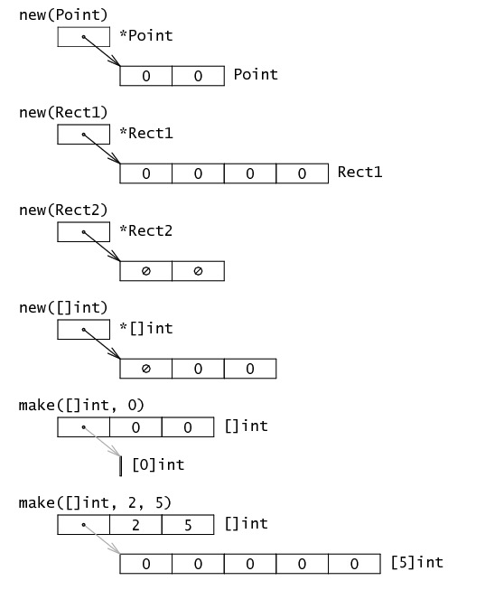

# 阅读源码的方法(不局限于go语言的源码)
## 一，摆正认识 
1. 对阅读代码这件事正确的认识很重要，核心思想指导行动，方法构建在核心思想之上，如果核心思想不正确，方法就不可靠。核心思想用比较现代的语言表述就是：元认知。
## 二，找到入口   
1. 万事开头难，刚刚开始接触一个全新的项目，是最难受的。这个时候如果自己可以把代码编译成可执行文件，并知道了程序的入口位置，剩下的就是时间问题。
## 三，梳理目录   
1. 找到程序入口之前，不用急着从入口阅读代码，先把所有的目录看一遍，大概了解目录的层次结构和用途，这样会事半功倍。如果没有搞清楚目录结构，就从入口阅读代码，每次跳进一个陌生的文件夹，连续跳转几次就回不到主线上了。
2. 在梳理目录的时候，如果目录下有说明文件一定要阅读，然后快速扫描目录中的每个文件的内容，文件开头的注释一定要看。文件中比较复杂的结构体、类、函数或方法列表等要关注，通过快速扫视对每个目录的用途有一个大概的判断。这个阶段酌情了解一下函数或者方法的实现即可，一般情况下只要看一下函数或方法的名字，就能大概猜到这个目录中代码的用途。
## 四， 逐行阅读
1. 对项目的目录结构有了基本的认知之后接下来就是最后一步：从程序入口处开始细细阅读。这期间经常遇见没见过的函数或者代码库，还有一些设计模式相关的代码。老外写代码特别喜欢用 factory、helper等等，各种传递各种类型转换，还有各种自动生成的代码，往往要向下穿透好几层才能找到熟悉的直白执行的代码。
2. 第一个对应的方法就很简单：见的多了，就熟悉了。第二个方法是：掌握好阅读的深度。   

3. 如果不是特殊需要，遇到一个陌生的库只需要知道它是什么、能用来做什么怎么用，至于是怎么实现的可以先不关心。要把时间和精力用在主线上，别一头扎入某个库的细节，忘了当前项目的主线，变成研究另一个项目了。特别是一些使用了框架的项目，先知道框架怎么用，把当前项目搞清楚后，再去研究框架自身是怎么实现的。

4. 掌握好阅读深度非常关键，因为代码浩如烟海，是读不完的，只依赖标准库的项目还好一些，否则 A 引 B、B 引 C，最终代码量成指数型增加。要善于抽象总结，逐行读代码，不是逐行看字母abcd，而是揣摩这些代码表达的意思，透过代码把握作者的思路想法。
## 技巧1 ： 忽视真正入口之前的代码
## 技巧2 ： 接口的实现一般就在接口定义的下方

# 基本类型 
## 一，结构体和指针
    结构体的域在内存中是紧挨这排列的
## 二，字符串  
    字符串在Go语言内存模型中用一个2字长的数据结构表示。他包含一个指向字符串存储数据的指针和一个长度数据。因为string类型是不可变的，对于多字符串同享一个存储数据是安全的。切分操作str[i:j]会得到一个新的2字长结构，一个可能不同的但仍指向同一个字节序列(即上文说的存储数据)的指针和长度数据。这意味着字符串切分可以在不涉及内存分配或复制操作。这使得字符串切分的效率等同于传递下标。
## 三，slice
    一个slice是一个数组某个部分的引用。在内存中，他是包含3个域的结构体；指向slice中的第一个元素的指针，slice的长度以及slice的容量。长度是下标操作的上界，。容量是分割操作的上界，如x[i:j]中j不能大于容量。
## 四，make和new
    Go语言有两个数据结构创建函数：new和make。基本的区别是new(T)返回一个*T，返回的这个指针可以被隐式的消除引用。而make(T,args)返回一个普通的T，通常情况下，T内部有一些隐式的指针。一句话，new返回一个指向已清零内存的指针，而make返回一个复杂的结构。

